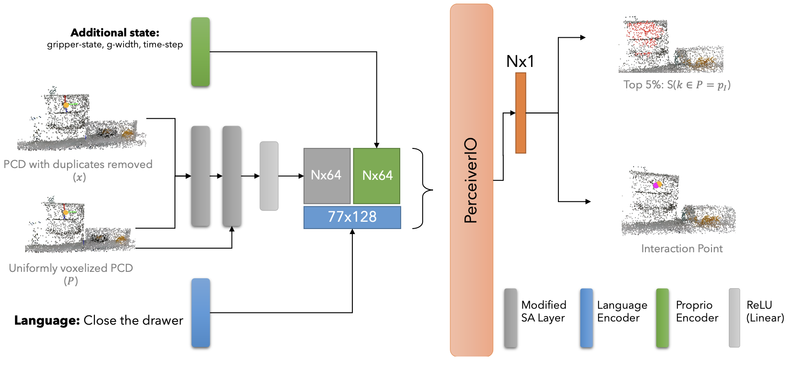
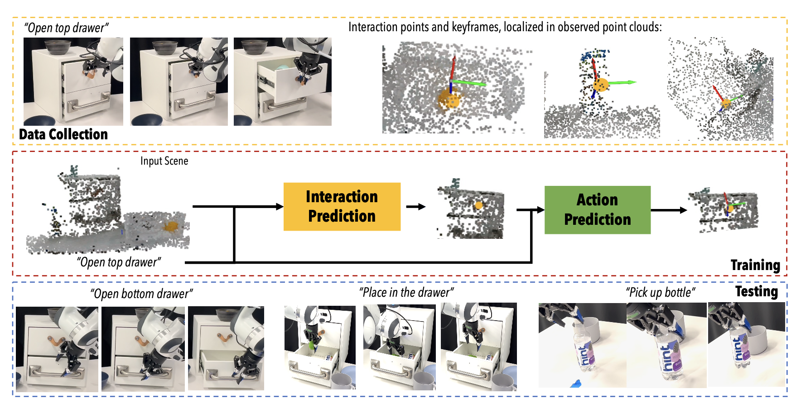
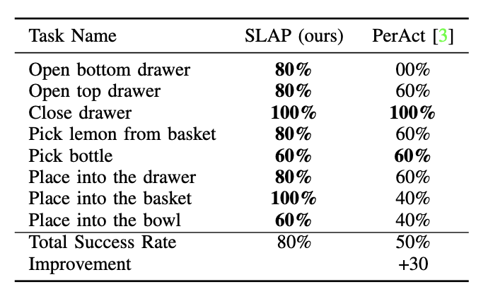

     SLAP: Spatial-Language Attention Policies      

Spatial-Language Attention Policies for Efficient Robot Learning
================================================================

Author Names Omitted for Anonymous Review; Paper ID: _193_

Abstract
--------

We investigate the problem of learning robust language-conditioned robot policies with minimal supervision in an efficient manner. While large multi-modal transformers show great promise as a solution to deploying robots in everyday environments, such approaches often require large amounts of data and do not generalize well to clutter, workspace size and occlusions. We propose Spatial-Language Attention Policies (SLAP), a method for training multi-modal robot skills as affordances in 3D space, SLAP removes many limitations of previous work, allowing us to build a wide variety of robot skills that are applicable to many different contexts. Our method produces effective language-conditioned policies, with an 80% success rate in the real world across eight tasks with a single model, and a 47.5% success rate when unseen clutter and unseen object configurations are introduced, even with only a handful of examples per task. This represents an improvement of 30% over prior work (20% given unseen distractors and configurations). SLAP policies train quickly and represent a useful strong approach for building robust language-conditioned robot skills.

Overview of SLAP
----------------

Overview of SLAP: Our method has two components: an “interaction prediction” module which localizes relevant features in a scene, and an “action prediction” module which uses local context to predict an executable action.

An overview of the classifier's architecture: The point cloud is downsampled to remove duplicates and encoded using two modified set-abstraction layers. The SA layers generate a local spatial embedding which is concatenated with proprioceptive features - in our case, the current gripper state. Both spatial and language features are concatenated and input into a PerceiverIO transformer backbone. We then predict an interaction score per spatial feature and the argmax is chosen as the interaction site for command _l_.

Process for SLAP training where demonstrations are collected and used to train the Interaction Prediction module and Action Prediction model. We can then make predictions on where the robot should move based on the predicted interaction point.

Results
-------

Predicted mask (red) of object of interest, and interaction sites (yellow)

SLAP vs PerAct comparision of performance on previously unseen real-world scenes of "in-distribution" configuration of objects.

Comparision of performances between our best-validation score model against PerAct on real-world instances. Both in and out of domain configurations used.

Website template inspired by [Nerfies: Deformable Neural Radiance Fields](https://github.com/nerfies/nerfies.github.io)
